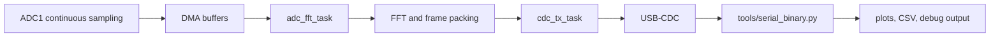

# ESP32-S3 Real-Time Dual-Channel FFT Streamer

This project is a learning-oriented embedded signal-processing pipeline: an ESP32-S3 continuously samples two ADC1 inputs, computes FFTs on-device, and streams framed spectra over USB-CDC to a Python host tool for plotting, logging, and inspection.

## Motivation & Goals

The project started as a way to deepen my understanding of DSP, signal pipelines, FFT algorithms, and hardware-oriented optimization.

The ESP32-S3 is not the most natural platform for this kind of system, which is exactly why it was useful. The S3 added new vector and DSP-oriented processor capabilities, and I wanted to explore how far those capabilities could be pushed in a complete signal-analysis pipeline.

The main goals were:

- build a complete signal analysis pipeline instead of a disconnected demo
- prioritize a system mindset over isolated algorithm experiments
- make debugging easy by keeping each subsystem observable and bounded
- keep ADC acquisition, FFT processing, and USB transport independent enough to reason about separately
- become more fluent with the ESP-IDF build system, Kconfig, and conditional compilation
- test the limits and practical viability of the ESP32-S3 as a DSP platform
- use platform-specific optimizations where they actually improve the pipeline

## Video of a Sweep and both Plotting Domains active


https://github.com/user-attachments/assets/b648e1cd-7d1b-4a7f-8c6a-fcc077de2a4f


--- 

## System Overview

The current repo is configured as a transport build. That means the firmware sends raw complex FFT bins to the host, and the host can reconstruct or visualize the signal as needed.




In practice the data path is:

1. `adc_continuous` samples two ADC1 channels into DMA buffers.
2. `adc_fft_task` performs the DSP work and builds a versioned frame.
3. `cdc_tx_task` sends the frame over TinyUSB CDC ACM with backpressure-aware flushing.
4. `tools/serial_binary.py` reads the stream on the host, validates CRCs, and turns the data into a usable desktop workflow.

## Why This Approach

- The firmware keeps acquisition and USB transport separate so the host can lag without stalling sampling.
- The on-wire format is stable and versioned, which makes the host parser easy to extend.
- The project documents the full path from low-level ADC data to a visual, inspectable result.
- The checked-in defaults are tuned for a realistic real-time demo instead of a toy example.

## Repository Layout

- [main/main.c](main/main.c): firmware entry point, ADC sampling, FFT processing, and USB framing
- [main/Kconfig.projbuild](main/Kconfig.projbuild): build-time options for transport mode, FFT size, sample rate, and filters
- [sdkconfig.defaults](sdkconfig.defaults): checked-in defaults for the current demo configuration
- [tools/serial_binary.py](tools/serial_binary.py): host-side frame reader, plotter, and inspector
- [tools/README.MD](tools/README.MD): command-line reference for the host tool
- [components/wave_gen](components/wave_gen): optional waveform-generation support used for lab/testing workflows using PCM5102 I2S dac or DAC-less with SDM 1-bit and a low-pass passive filter

## Quick Start

From a fresh clone:

```bash
git clone <repo-url>
cd newproject
# Init IDF project/workspace
idf.py menuconfig 
# Change PSRAM and Flash size if they differ from my N16R8 defaults
idf.py build
idf.py flash
idf.py monitor
```

Host-side inspection:

```bash
uv run serial_binary.py --inspect-frames --max-frames 200 --port COMx
```

Replace `COMx` with the device port. Add `--hex-dump` when you want a byte-level look at the payload.

## Current Defaults

The checked-in `menuconfig` configuration is tuned for the current transport demo:
> **Meaning** raw FFT bin data transported off device. Any windowing, Top-K, Filtering is done on the python side to enable clean reconstruction

- `CONFIG_ADC_FS=44100`
- `CONFIG_ADC_FFT_SIZE=8192` 
  > *__Radix-4: Valid power of 4 values__*
  >- 32
  >- 128
  >- 512
  >- 2048
  >- 8192
- `CONFIG_TINYUSB_CDC_TX_BUFSIZE=32768`
- `CONFIG_ESP_WIFI_ENABLED` is disabled to keep the ADC path quiet and deterministic
- `CONFIG_STATUS_NEOPIXEL_ENABLE=y` for simple runtime feedback

---
> The **Kconfig** Transport and Display mode hooks are deprecated.

> The functionality for on device Windowing, Top-K bins, IIR filtering remains and could be re-enabled with some work.


## Frame Format

Each frame contains:

- a 4-byte magic value
- a 1-byte version
- a 2-byte sequence number
- a 2-byte payload length
- a payload with timestamp, sample rate, FFT size, channel label, and float data
- a 4-byte CRC32

This structure gives the host a fast way to verify the stream and recover cleanly if the device resets or the connection drops.

## Further Reading
- [Doxygen Function Graph/Docs](https://rt-rtos.github.io/S3-FFT-Matplot/html)
- Start with [main/main.c](main/main.c) if you want to follow the firmware pipeline.
- Open [tools/serial_binary.py](tools/serial_binary.py) if you want to see how the host consumes the frames.
- Use [tools/README.MD](tools/README.MD) for the full host-side CLI reference.
